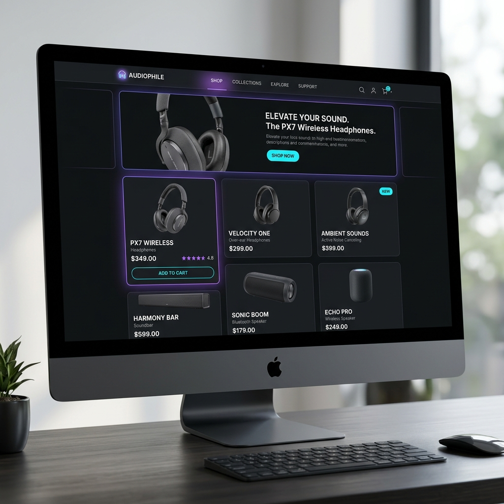
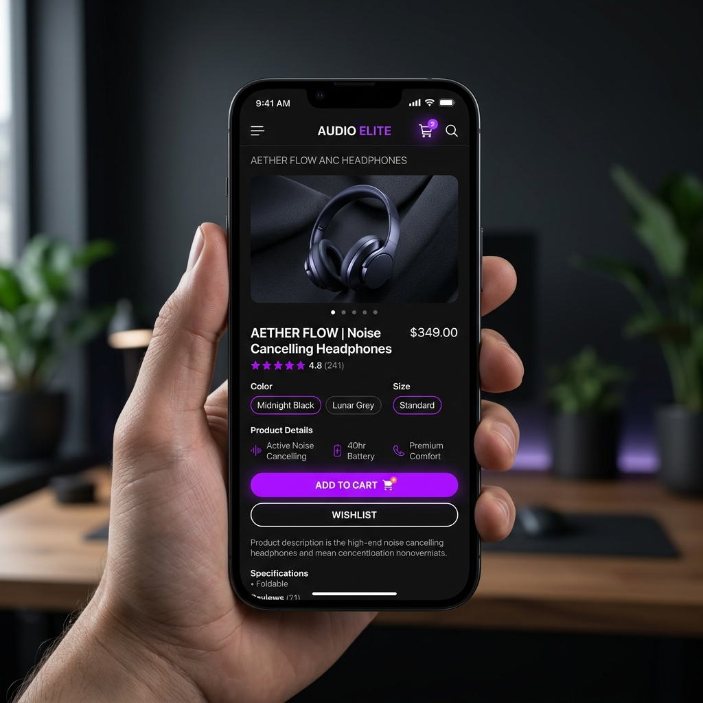

# Lumina Co. - Premium E-Commerce Website

> A premium, visually-rich e-commerce experience for high-end audio and smart lifestyle gadgets featuring dynamic animations and responsive controls.

## 🌐 Live Demo
**GitHub Pages:** https://KalaiarasanE.github.io/E-commerce-website/

---

## 📸 Screenshots

### Desktop


### Mobile


---

## ✨ Features

- Responsive UI
- Interactive slide-out Cart Drawer with dynamic quantity adjustments and persistent localStorage state
- Interactive slide-out Wishlist Drawer to save and move favorite items to the cart
- Dynamic search bar and category pill-filters with instant list updates and sorting options
- Elegant product Quick-View modal with rating systems, descriptions, and technical specifications
- Cross-browser compatibility
- Clean and modern design

---

## 🛠️ Tech Stack

- HTML5
- CSS3
- JavaScript (ES6)
- Responsive Design
- Git & GitHub
- AI-assisted development

---

## 🎨 Design References

- Refero – https://refero.design/
- Godly – https://godly.website/
- Aceternity UI – https://ui.aceternity.com/

---

## 🤖 AI Tools Used

This project was developed with AI assistance for:

- UI layout ideas
- Component generation
- CSS optimization
- JavaScript functionality
- Debugging
- Documentation improvements

---

## 📚 What I Learned

- Designing responsive layouts with complex CSS Grid/Flexbox and implementing dark modes with custom CSS variables
- Managing application state in vanilla JavaScript, including localStorage syncing for persistence and event delegation for dynamic grids
- Structuring smooth slide-out drawers, animated notifications (toast items), and visual success cues using CSS transitions and keyframes

---

# 🚀 About TAP Academy

TAP Academy is an industry-focused training institute that helps students become job-ready software engineers through hands-on learning, real-world projects, mock interviews, and placement preparation.

### Why TAP Academy?

- Placement-focused training
- Real-world project development
- AR-enabled classrooms
- Daily coding practice
- Mock interviews
- Industry mentors
- Resume building
- Git & GitHub workflow
- Frontend and Full Stack Development
- Career guidance
- Placement support within 60 days for eligible students

Learn more:
https://thetapacademy.com/

---

## 📥 Installation

```bash
git clone https://github.com/KalaiarasanE/E-commerce-website.git

cd E-commerce-website

open index.html
```

---

## 👨💻 Author

**Kalaiarasan E**

GitHub: https://github.com/KalaiarasanE

LinkedIn: https://www.linkedin.com/in/kalaiarasane

Portfolio: https://kalaiarasane.github.io/portfolio

---

## ⭐ Support

If you like this project, give it a ⭐ on GitHub.
